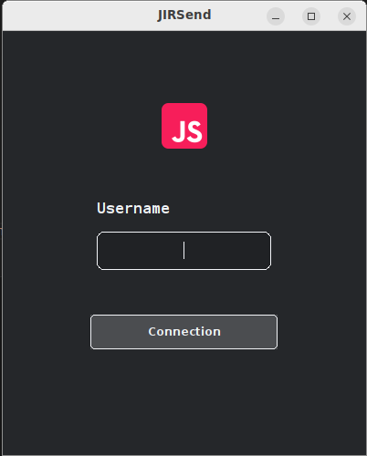
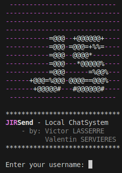
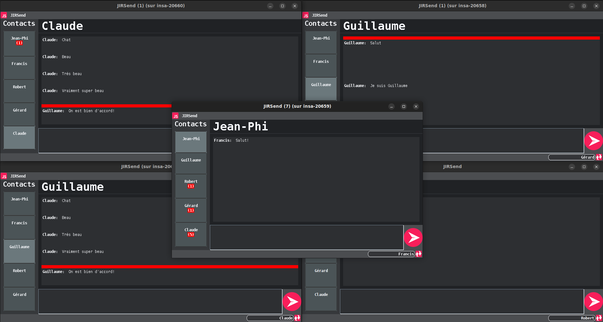
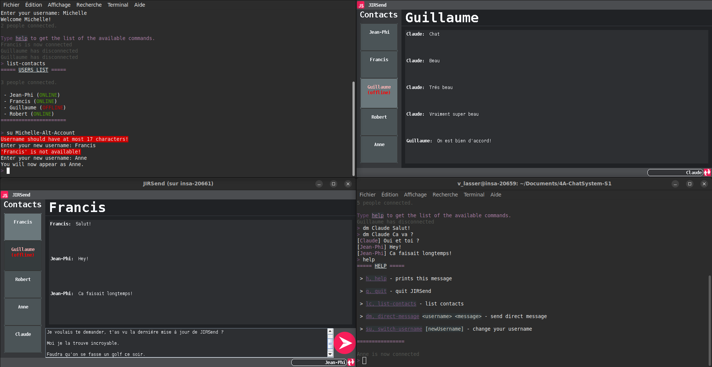
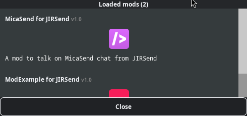

# JIRSend
<div style="text-align:center">
<br>
</div>

## What is JIRSend ?
JIRSend is a decentralized chatsystem working on local network.\
The goal it to allow every user on a local network to chat with each other, but without a central server.\
For this purpose, JIRSend must detect automatically all users on the network so that any user can know who is connected.

### Functionalities

Here is a non-exaustive list of JIRSend features:
- A pretty Graphical User Interface (GUI)
- A pretty Command Line Interface (CLI) allowing to use JIRSend without a X11 Display (like most ssh connections)
- Awesome logo 
- Discover other users on the network
- Change your username
- Prevent two users from having the same name
- Send any text-message to anyone connected
- Autocompletion and history in the CLI!
- Get visually notified when you get a message
- ... and much more !

## INSTALLATION

### No compilation needed:

1. go to the [releases section](https://github.com/insa-4ir-chatsystem/chatsystem-lasserre-servieres/releases)
2. download the latest release

### Build from source

```bash
git clone git@github.com:insa-4ir-chatsystem/chatsystem-lasserre-servieres.git
cd chatsystem-lasserre-servieres
mvn package clean
```
This should create a .jar file *`JIRSendApp/target/JIRSendApplication-jar-with-dependencies.jar`*.

## How to run the project

> [!IMPORTANT]
> First, JIRSend will launch differently depending of it's arguments.\
> If you want to launch as a Command Line Interface, use the *--cli* argument.\
> If you are debugging, use the *--debug* argument.

### Run JIRSend with GUI
Use one of the following methods:
- Double-click on the previously downloaded/built .jar file
- Enter the folowing command:
```bash
java -jar path-to-file.jar
```

### Run JIRSend with CLI

Enter the following command:
```bash
java -jar path-to-file.jar --cli
```

## Project Overview

<div style="text-align:center">

<br>
</div>
<div style="text-align:center">
<br>
</div>
<br>
<div style="text-align:center">
<br>
</div>

---

## To build mods

### Install JIRSendAPI
Install the dependency JIRSendAPI.

```sh
mvn clean install
```

### Build the mod
Then go in the directory of the mod you want to build and execute
```sh
mvn clean package
```

### Install the mod
Copy the `target/*-jar-with-dependencies.jar` into your `mods/`.\
Launch.\
You should see a button `Mods`. Click on it, you should see your mod in it.


## To create mods

### Import in Maven
Once you installed the JIRSendAPI dependency, you will be able to import it in your Maven configuration
```xml
<dependency>
    <groupId>com.JIRSend</groupId>
    <artifactId>JIRSendAPI</artifactId>
    <version>1.0-SNAPSHOT</version> <!--you might check the version-->
</dependency>
```

### Implement JIRSendMod.java interface
The easiest way might be to look at the existing source of the mods in `mods/`

### Build
Export your .jar, put it in `mods/`, enjoy !